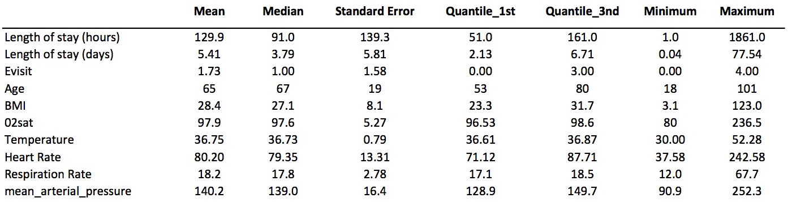
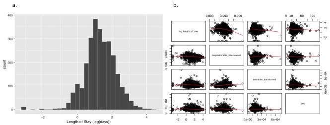

```{r setup, include=FALSE}
knitr::opts_chunk$set(echo = TRUE)
library(knitr)
library(tidyverse)
library(janitor)
library(readxl)
library(stringr)
library(readr)
library(gridExtra)
hospital_data_cleaned = read_csv("data/hospital_data_cleaned.csv")
data_no_outliers = read_csv("data/data_no_outliers.csv")
```
# Abstract
We present a linear regression model for the prediction of hospital length of stay. The model has good internal validity and explains approximately 17.5% of the variation in hospital length of stay.

# Introduction
In an era of rising healthcare expenses, one of the major drivers of the costs in an inpatient care setting is the length of hospital stay. A better understanding of the characteristics driving length of hospital stay will be needed in order  identify patients at risk for long hospital stays and implement strategies designed to help these patients leave the hospital earlier. 

In order to better understand characteristics associated with increased length of stay, we develop a linear regrestion model to predict length of stay. A dataset containing 3612 are used to fit the model. The following covariates are considered for inclusion: age, gender, race, religion, marital status, insurance type, vital status, severity of comobidity (measured using Charlson comorbidity index), number of visits to the ER in the prior six months, whether the patient as admitted to the ICU. Descriptive statistics for all continuous covariates considered for inclusion are presented in table 1. 


*Table 1*: Summary statistics for continuous covariates considered for inclusion in predictive models. 

#Methods
##Data Cleaning
Data cleaning and analyses were conducted in R and SAS. For subjecta with more than one hospitalization, only the first hospitalization was included in analyses. Subjects that were missing any of the following data were excluded: patient ID, visit ID, length of stay, hospital admission witin the last 30 days, MEW score, C index, number of admissions in 6 months prior, age, gender, race, religion, marital status, insurance type.

Due to the high degree of anticipated collinearity between systolic and diastolic blood pressure, mean arterial pressure was calculated from these two variables and used in all subsequent model fitting analyses.  

The below categorical and ordinal variables were reclassified in order to combine levels that provided no new information or that had too few observations for meaninful analysis:
 
 * MEW score: Levels 0 and 1 were reclassified as "normal", levels 2 and 3 were reclassified as "increase caution", levels 4 and 5 were reclassified as "further deterioration", levels 6 and above were re-classified as immediate action.
 * C index: Level 0 reclassified as "normal", levels 1 and 2 were reclassified as "mild", levels 3 and 4 were reclassified as "moderate", levels 5 and above were reclassified as "severe."
 * Religion: "Angelican" was reclassified as "Christian," "Hebrew" was reclassified as "Jewish", "Non-Denominational" was reclassified as "Other," "Catholic" was reclassified as "Christian", "Mormon" was reclassified as "Other."
 * Marital Status: "Married" and Civil Union" were reclassified as "partnered," all other categories were reclassified as "not partnered."

##Preliminary Analyses
  
*Figure 1*: a) Histogram of log transformed outcome variable, and b) scatter plots showing relationships between continuous variables after transformations. 

A histogram of LOS was visually inspected and substantial skewness was observed. Log transformation successfully rendered LOS approximatley normal (figure 1). Bivariate relationships between continuous predictors and length of stay were examined by visual inspection of scatter plots. Oxygen saturation, temperature, heart rate, and respiration rate appeared to have non-linear relationships with LOS. As such, respiration rate and heart rate were transformed using the below transformation equation:
$$T(X) = \frac{1}{X^2}$$
Oxygen saturation and temperature were re-classified into categorical variables as below: 

* Oxygen saturation: saturations below 95% were defined as "low" and saturations from 95-100% were defined as "normal."

* Temperature: Body temperatures bewteen 36.1 and 37.2 degrees were defined as "normal." Temperatures below 36.1 degrees were defined as "low," and temperatures above 37.2 degrees were defined as "high".

After these adjustments were made, all continuous variables appeared to have approximately linear relationships with LOS by visual inspection of bivariate scatter plots (figure 1). 

All pairs of continuous predictors were examined for collinearity by calculating all pairwise correlations. There did not appear to be substantial collinearity between any predictors (table 1). 

```{r echo=FALSE}
hospital_data_cleaned %>%
  select('Age' = age, 'Respiration Rate' = respirationrate_transformed, 'Mean Arterial Pressure' = mean_arterial_pressure, 'Heart Rate' = heartrate_transformed, "BMI" = bmi) %>%
  cor() %>%
  knitr::kable(format = "latex", 
               booktabs = TRUE) %>% 
  kableExtra::kable_styling(latex_options = "scale_down", font_size = 4)

```
*Table 2*: Correlations between continuous covariates. 

##Variable Selection and Model Building
Variable selection was conducted using backward, forwards, and stepwise methods. Effect significance level of $alpha$ = 0.05 was required for a variable to stay in or enter the model for all variable selection processes. 

Variables selected by all methods include: 30 day readmit, number of ER visits in last six months, age, insurance type, heart rate, respiration rate, and mean arterial pressure. Additional variables selected using forward selection include: c-index, temperature, and partner status. Additional variables selected using backward selection include: gender and partner status. Additional varaibles choosen by stepwise selection include: c-index, temperature, and heart rate. The models selected by the forward and stepwise processes performed better that the model selected by the backwards variable selection process based on model diagnotic criteria including residual sum of squares, adjusted R-squared, BIC, and AIC (table 3). Diagnostic criteria for models selected in the forward and stepwise processes were similar to one another (table 3). Since the model selected in the stepwise process was a subset of the model selected in the forward process with only one less variable (marital status), we conducted an ANOVA test to compare nested models. Based on the results of the ANOVA test, we concluded that the addition of marital status significantly improved the predictive capability of the model (F = 4.4441; p = 0.035). 


In order to improve residual normality, observations with outlier residual values (> 2.5 after standardization) were removed from the data, and the model was re-fit using the process described above. Models selected using the stepwise and backward processes were the same and included the following variables: 30 day readmit, c-index, number of ER visits in last six months, age, gender, marital status, insurance type, BMI, temperature, heart rate, respiration rate, and mean arterial pressure. Additional variables selected in the forward process include: ICU admission, religion, and oxygen saturation. All models performed similarly by diagnostic criteria (table 3). The additional variables selected in the forward process significantly improved the model by ANOVA testing (F = 3.9807; p < 0.001). Assumptions for this model (Model 2) were asssesed by visual inspection of the appropriate plots; residuals associated with model 2 were approximately normal, uncorrelated with the fitted outcome values, and no influential points were identified by Cook's Distance.  


*Table 3*: Diagnostic criteria for models with and without outlier data.


#Results
In table 4, we present a prediction model for length of stay. The model explains 17.5% of the variability in length of stay. Bootstrapping was used to assess interal validity, and good internal validity was observed. 

```{r echo=FALSE}
forward_subset2 = lm(log_length_of_stay ~ is30dayreadmit + cindex + evisit + icu_flag + age + gender + religion +  maritalstatus + insurancetype + bmi + o2sat_cat + temperature_cat + heartrate_transformed + respirationrate_transformed + mean_arterial_pressure, data = data_no_outliers)

broom::tidy(forward_subset2) %>%
  knitr::kable(format = "latex", 
               booktabs = TRUE) %>% 
  kableExtra::kable_styling(latex_options = "scale_down")
```
*Table 4*: Prediction model for length of stay. 

#Discussion 
Because outlier data were removed in order to develop the final model, we urge extreme caution in using this model to make predictions. While this model is likely to have some predictive capability for specific types of patients, the model cannot be generalized to patients whose characteristics differ substantially from the patients used in the sample to develop the model.

Additional work will be needed in order to develop models with better predictive capability and increased generalizability. Different modeling methods such as generalized linear models may provide more robust prediction models. 

Further, these variables may not be the best variables to predict hospital length of stay. It's possible that there are other variables that need to be explored in order to better understand characteristics that predict length of stay.


 